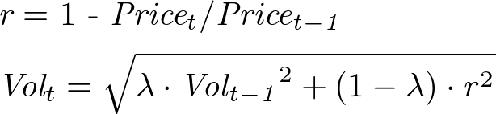
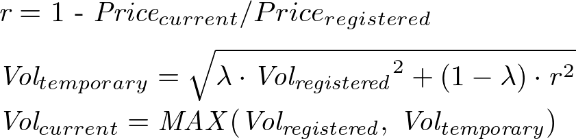

# Lien Volatility Oracle

## What is Lien Volatility Oracle?
- A simple historical volatility is used in the current ongoing products.
- Simple historical volatility can cause a spike of volatility, which may cause a mispricing.
- The best would be to use an implied volatility oracle for pricing, but as of now there is no reliable external source.
- In this oracle, the contract calculate and register EWMA Volatility based on historical prices at regular interval.

## What is EWMA Volatility?
- See [Explanation](https://www.investopedia.com/articles/07/ewma.asp)
## Volatility Registration
1. Calculate the next timestamp of registration(e.g. in 24 hours).
2. Get price from ChainLink price oracle with the first timestamp after the next regular-interval timestamp(e.g. UTC 0:00).
3. Calculate next EWMA volatility with optimised parameter as following: 

<div align="center">

</div>

4. Register the volatility along with the regular-interval oracle price.

## Current Volatility Calculation
1. Get the latest chainlink price and calculate the relative change ratio to the last regular-interval price.
2. Calculate the volatility in the same manner as the equation above.
3. Return the volatility as MAX(the latest recorded volatility, the volatility).
<div align="center">

</div>

## Change Optimised Parameter
- The quants analyst address can change the optimised parameter (lambda) within a certain range when the market condition changes.
1. When labmda is updated, the latest price is recalculated with the new labmda.
2. Recalculation starts from the registered volatility at `latestTimestamp - _dataNum * _interval`.

## About Corrections from the first audit report
The corrected points are marked with ```AUDIT-FIX``` comment.
### Unchanged Points
- RIO-01: In our local environment, import path starting with `@openzeppelin` does not work.
- RIO-15: User cannot specify chainlink roundId which is to be registered in this contract. (See )
- RIO-16: Variable `_interval` is about 1~7 days in seconds. So, overflow of `_latestTimestamp` will not occur
- RIO-17: Same reason as RIO-15
- RIO-22: `interval` is non-0 value.
- RIO-20: Variables have been already checked before this line.
- RIO-23: Same reason as RIO-16
- RIO-24: Same reason as RIO-16
- RIO-25: Same reason as RIO-16
- RIO-28: Price is checked in  `_getPriceFromChainlinkWithAggregator()`, so overflow will not occur.
- RIO-30: `hintID` at this point is guaranteed to be more than 0
- RIO-31: Variable `index` is incremented by 1 for each registration, so overflow will not occur.
- RIO-32: Same reason as RIO-16
- RIO-33: Rational price will be returned before `roundID` becomes 0 since rational prices are recorded on chainlink with positive roundIDs
- RIO-35: Same reason as RIO-16


